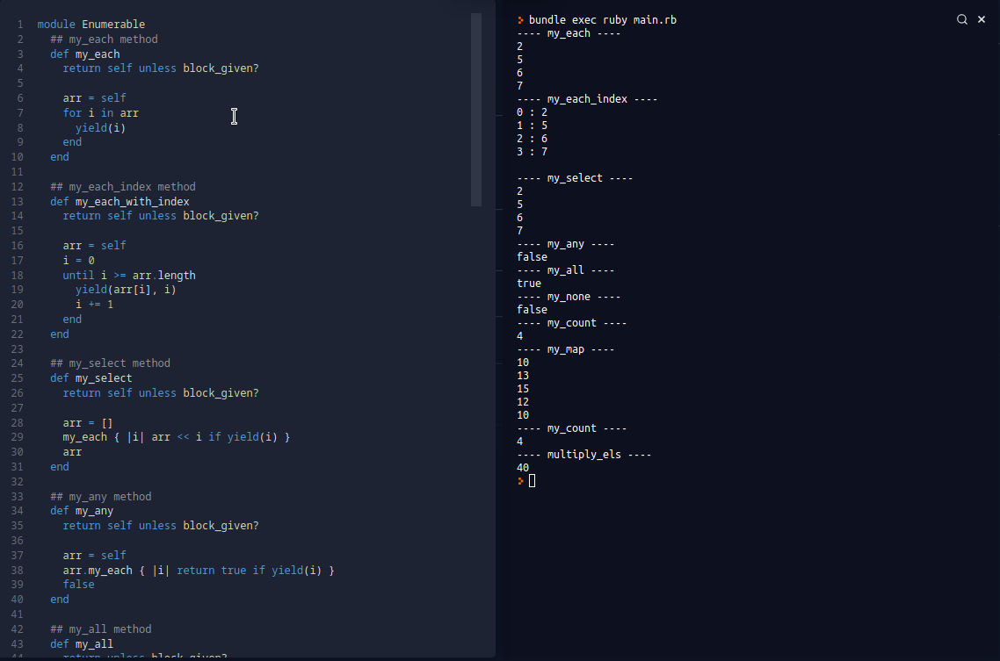

# Enumerables

> This project shows custom made enumerables

This is our 2nd ruby project in microverse

## Built With

- Ruby

## Live Demo

## Getting Started

1. Clone the project 
  https://github.com/vikitaotiz/enumerables/tree/devepment
  
2. Then open https://replit.com/languages/ruby

Copy and paste the code in replit.com

3. For local use: CD into the cloned repository. 

4. Run "ruby ./" then type the name of the file
### Prerequisites

Just ensure you have one or more web browsers

## Authors

:bust_in_silhouette: **Author1**

- GitHub: [@igorkol91](https://github.com/igorkol91)
- Twitter: [@Destro49536502]
- LinkedIn: [LinkedIn](https://linkedin.com/in/linkedinhandle)

:bust_in_silhouette: **Author2**

- GitHub: [@vikitaotiz](https://github.com/vikitaotiz)
- Twitter: [@victoro29641869]
- LinkedIn: [LinkedIn](https://linkedin.com/in/linkedinhandle)

## :handshake: Contributing

Contributions, issues, and feature requests are welcome!
Feel free to contribute 

## Show your support

Give a ⭐️ if you like this project!
